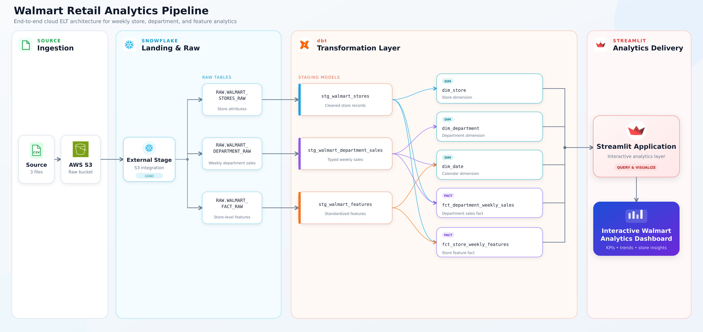

# Walmart Retail Analytics

An end-to-end retail analytics pipeline that loads Walmart store data from AWS S3 into Snowflake, transforms it with dbt, and serves the resulting data marts through a Streamlit dashboard. The project covers weekly sales performance by store, department, time period, holiday status, and economic conditions.

## Architecture



The pipeline has four stages:

1. Three source files—stores, department sales, and store-level features—land in AWS S3.
2. A Snowflake external stage loads the files into raw tables.
3. dbt cleans, tests, and models the data into dimensions and facts.
4. Streamlit queries the marts and presents the results with Plotly.

## Data design

The source tables have different grains. Sales is recorded by store, department, and week; weather and economic features are recorded by store and week. The pipeline preserves these grains in separate fact tables. When sales is compared with temperature or CPI, department sales is aggregated to store-week level before the join. This avoids repeating feature values across departments and overstating results.

The dbt project is organized into four layers:

| Layer | Purpose |
|---|---|
| Staging | Casts source fields, standardizes names, removes duplicates, and creates deterministic keys |
| Intermediate | Builds a consistent reporting calendar and aggregates sales to store-week grain |
| Snapshot | Retains changes to department sales and store-week features |
| Marts | Publishes the dimensions and facts used by the dashboard |

The final reporting layer contains five tables:

| Model | Grain and purpose |
|---|---|
| `dim_store` | One row per store with current type and size |
| `dim_department` | One row per department |
| `dim_date` | One row per reporting week with calendar and holiday attributes |
| `fct_department_weekly_sales` | Versioned sales by store, department, and week |
| `fct_store_weekly_features` | Weather, markdown, and economic measures by store and week |

Store and department dimensions use incremental Snowflake merges and follow a Type 1 approach.

Both fact tables use dbt snapshots to preserve revisions. Each fact version has start and end timestamps plus an `is_current` flag. The dashboard reads current records, while prior versions remain available for audit and reconciliation.

## Data quality

dbt tests validate the pipeline at both the column and business-rule level. They cover:

- Required and unique keys
- Accepted store types
- Relationships between facts and dimensions
- Store-week grain after sales aggregation
- Consistent holiday status across source tables
- Reconciliation of current mart sales to staging totals

## Dashboard

The Streamlit application queries the five Snowflake mart tables and caches results for 15 minutes. Users can filter by year, store type, holiday status, and store.

| Page | Analysis provided |
|---|---|
| Executive Overview | Sales KPIs, weekly trend, store-type mix, and top stores |
| Sales Performance | Sales by year, month, day, store type, and holiday status |
| Store & Department | Department rankings and sales comparisons by store size and type |
| Market Factors | Markdowns, fuel price, temperature, and CPI analysis |

Plotly provides interactive charts and trend lines. Market-factor analysis uses store-week sales rather than department-level rows to maintain the correct grain.

## Technology

| Tool | Role |
|---|---|
| AWS S3 | Raw file landing zone |
| Snowflake | External stage, raw storage, and analytical warehouse |
| dbt | Transformations, incremental models, snapshots, tests, and documentation |
| SQL and Jinja | Warehouse logic and reusable macros |
| Python and pandas | Dashboard queries and data preparation |
| Streamlit and Plotly | Interactive analytics and visualization |

## Running the project

### Prerequisites

- An S3 bucket containing `stores.csv`, `department.csv`, and `fact.csv`
- A Snowflake account with permission to create the required objects
- Python 3.10 or later
- `dbt-snowflake`

### 1. Load the raw data

In `snowflake/PP1-BI-Data-Analysis-Walmart.sql`, replace `<AWS_IAM_ROLE_ARN>` and `<BUCKET_NAME>` with values for your environment. Run the script in Snowflake to create the storage integration, external stage, schemas, file format, raw tables, and `COPY INTO` operations.

After running `DESC INTEGRATION S3_INT`, add the returned Snowflake IAM values to the AWS role's trust relationship before loading the files.

The provisioning script uses `ACCOUNTADMIN`. Use separate least-privilege roles for dbt and Streamlit connections.

### 2. Build the dbt project

Create a `walmart_analytics` entry in `~/.dbt/profiles.yml`:

```yaml
walmart_analytics:
  target: dev
  outputs:
    dev:
      type: snowflake
      account: <account_identifier>
      user: <username>
      password: <password>
      role: <dbt_role>
      database: PP1_WMRT
      warehouse: <warehouse>
      schema: STAGING
      threads: 4
```

From the repository root:

```bash
dbt debug
dbt build
```

Optional dbt documentation:

```bash
dbt docs generate
dbt docs serve
```

### 3. Run the dashboard

```bash
cd streamlit
python3 -m venv .venv
source .venv/bin/activate
pip install -r requirements.txt
cp .streamlit/secrets.toml.example .streamlit/secrets.toml
```

Add the Snowflake connection details to `.streamlit/secrets.toml`, then run:

```bash
streamlit run app.py
```

The secrets file is excluded from Git. The dashboard role requires warehouse usage and `SELECT` access to the five tables in `PP1_WMRT.MARTS`.
